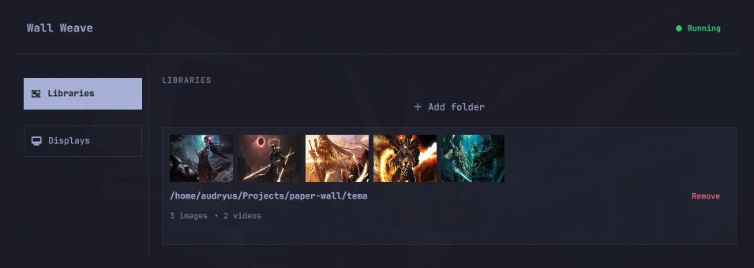
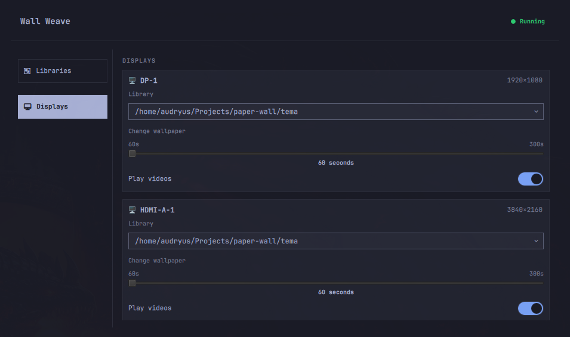

# Wall Weave

**Wall Weave** is an [Omarchy](https://omarchy.org/) bar-widget plugin that lets you rotate wallpapers per monitor.

You add folders full of images (and videos), pick one folder per display, set a timer, and Wall Weave keeps changing the wallpaper in the background. On multi-monitor setups each screen can run its own library, its own interval, and its own video setting.

> [!IMPORTANT]
> **Honest disclaimer:** A human with a soul and a caffeine addiction designed the structure, drove the logic, and made the calls. An AI (with a lot more free time) played a real role too: it helped design, wrote and refactored large parts of the code, translated comments, wrote the unit tests, and validated the whole thing — always with the human in the loop reviewing, correcting, and taking responsibility. So: **human-led, AI-assisted, human-approved.** If it starts speaking in binary, pull the plug.

## Screenshots

### Libraries

Add the folders that hold your wallpapers. Each library shows a thumbnail preview strip, its path, and how many images and videos it contains.



### Displays

One card per monitor: pick which library it rotates through, set the change interval (60–300 seconds), and choose whether videos may play on that screen.



---

## Requirements

| Requirement | Why | How to install |
|---|---|---|
| **Omarchy** | Host system (bar, shell, plugins) | Already on your machine if you are reading this on Omarchy |
| **Python 3** | Runs the backend (standard library only, nothing to `pip install`) | Already on Omarchy (`python` is a dependency of `uwsm`) |
| **mpvpaper** *(recommended)* | Shows image **and** video wallpapers, per monitor | Without it, images fall back to Omarchy's global background (same image on every screen) and videos are disabled |
| **ffmpeg** | Generates thumbnail previews for libraries | Usually already present; needed only for previews |
| **zenity** | "Add folder" file picker dialog | Needed only when adding a library from the UI |

## Installation

There is no build step: the backend is plain Python that `Backend.qml` runs straight from the plugin folder.

### Install the plugin

```bash
omarchy plugin add https://github.com/audryus/wallweave.git --enable
```

(`omarchy plugin install` is an alias for the same command. Drop `--enable` if you prefer to enable it later.)

What this does:

1. Clones this repository into `~/.config/omarchy/plugins/audryus.wallweave/`
2. Validates `manifest.json`
3. Rescans plugins
4. With `--enable`, asks which bar section to place it in (`left` / `center` / `right`; the manifest default is **right**)

### Which branch does it install?

**`trunk` — and you do not need to rename anything.**

- This repository's default branch is **`trunk`** (`origin/HEAD` points to `origin/trunk`). There is no `main` branch.
- `omarchy plugin add` runs a plain `git clone <url>`, and `git clone` always checks out the remote's **default** branch.
- Therefore the command above installs `trunk` as-is. No rename, no extra flags.

### Enable / disable / update / remove

```bash
omarchy plugin enable  audryus.wallweave   # add it to the bar (asks for section)
omarchy plugin disable audryus.wallweave   # hide it from the bar
omarchy plugin update  audryus.wallweave   # git pull the latest trunk
omarchy plugin remove  audryus.wallweave   # uninstall
```

After enabling, the widget appears in the chosen bar section. Click it to open the popup.

## Usage

1. Click the **Wall Weave** icon in the bar (looks like ``, Nerd Font `nf-md-wallpaper`).
2. Open the **Libraries** tab and click **＋ Add folder**. Pick a folder with images or videos. Wall Weave counts the files and generates thumbnails (via ffmpeg) into a `thumbs/` subfolder.
3. Open the **Displays** tab. For each monitor you can:
   - **Library** — choose which folder this monitor rotates through (`Omarchy global` means "do not manage this screen").
   - **Change wallpaper** — set the rotation interval (60–300 seconds).
   - **Play videos** — allow video wallpapers on this screen (requires mpvpaper).
4. Watch the status badge in the header:
   - **Running** (green) — mpvpaper is installed.
   - **Degraded** (yellow) — mpvpaper is missing; hover for details.
   - **Loading...** (red) — the backend has not answered yet.

## Architecture

Wall Weave is split into two processes that talk over **stdin/stdout, one JSON object per line**:

```
┌──────────────────────────────────────────────────────────────────┐
│  omarchy-shell (Quickshell / QML)                               │
│                                                                  │
│  ui/shell.qml          bar button + PopupCard host               │
│    └─ ui/Main.qml      full popup layout                         │
│         ├─ Backend.qml  spawns & talks to the Python process     │
│         ├─ Status.qml   health badge (header)                    │
│         ├─ Menu.qml     left nav (Libraries / Displays)          │
│         ├─ Library.qml  add/remove wallpaper folders             │
│         └─ Display.qml  per-monitor settings                     │
│              │                                                   │
│              │  write: {"cmd":"edit_display", ...}\n             │
│              │  read:  {"type":"edit_display", ...}\n            │
└──────────────┼───────────────────────────────────────────────────┘
               │  stdin / stdout (JSON Lines)
┌──────────────┼───────────────────────────────────────────────────┐
│  python3 -u -m backend ▼                                         │
│                                                                  │
│  __main__.py           line loop: read Request → write Response  │
│    └─ Commander         registry of commands                     │
│         ├─ status.py    probe mpvpaper                           │
│         ├─ library.py   scan folders, ffmpeg thumbnails          │
│         ├─ display.py   monitor list & settings                  │
│         ├─ worker.py           one rotation loop per display     │
│         ├─ mpv.py              long-lived mpvpaper + IPC swaps   │
│         └─ worker_lock.py      multi-process master election     │
│              │                                                   │
│              ▼                                                   │
│         SQLite (wallweave.db)  displays / libraries / status     │
│              │                                                   │
│              ▼                                                   │
│         mpvpaper (IPC socket) · omarchy theme bg                 │
└──────────────────────────────────────────────────────────────────┘
```

### How a command flows

1. The user clicks something in QML (for example, picks a library for a monitor).
2. `Backend.qml` writes one JSON line to the backend process: `{"cmd":"edit_display","display":{...}}`.
3. `backend/__main__.py` reads the line, parses it into a `Request`, and `Commander.exec` looks up the handler by name.
4. The handler updates SQLite, does its work, and returns a `Response`.
5. `Backend.qml` parses the response line and emits a typed signal (`displaysReceived`, `statusReceived`, …).
6. The matching QML component reacts and updates the UI.

### Commands (JSON API)

| `cmd` | Purpose | Extra fields |
|---|---|---|
| `get_status` | Probe tools and return/save health | — |
| `browse_libraries` | List all libraries | — |
| `add_library` | Scan a folder, make thumbnails, insert row | `path` |
| `del_library` | Delete a library (wakes workers) | `id` **or** `path` |
| `browse_displays` | List monitors (bootstraps from `hyprctl` on first run) | — |
| `edit_display` | Update theme/timer/video for one monitor | `display` |

Every answer has the shape `{"type": "<same or error>", "code": "<error key, errors only>", "message": "<payload or text>"}`.
Known errors carry a stable `code` (e.g. `folder_exists`) that the UI translates; technical failures only have `message`.

### Wallpaper workers

- One **worker thread per display** that has a library selected (`theme != 0`).
- Each worker loop: read settings → wait for timer **or** wake signal → pick the next file from a shuffled list (wraps forever) → apply it.
- **Images and videos:** each monitor has **one long-lived mpvpaper** (loop, no audio, auto-pause when hidden). The worker swaps the file through mpv's IPC socket (`$XDG_RUNTIME_DIR/wallweave/mpv-<monitor>.sock`, `loadfile`) instead of restarting it. mpvpaper is only started at boot or after a crash.
  - Why: starting/killing a wallpaper process (or changing a hyprpaper wallpaper) destroys and recreates a layer surface, and Hyprland then sends pointer events to the window under the cursor — a fullscreen video on *any* monitor would show its hidden cursor and player controls on every rotation. Swapping the file keeps the same surface.
  - Images fill the screen (cropped edges); videos keep their whole frame.
- **Without mpvpaper:** images fall back to `omarchy theme bg set` (global, same image on every screen); videos are skipped.
- **Back to "Omarchy global":** sets the theme's default background and stops that monitor's mpvpaper.
- **Changing library or deleting one** wakes the workers immediately so they do not wait for the timer.

### Multi-monitor = one backend

With two monitors, the Omarchy bar loads the widget twice. The backend is **not** owned by the widget: the plugin also declares a `service` entry point (`ui/Service.qml`), which omarchy-shell mounts **once** per shell. Every widget instance looks it up with `bar.shell.serviceFor("audryus.wallweave")`, so all monitors share a single `python3 -m backend` process. The standalone preview (`make run`) has no shell, so it starts its own backend.

A second backend can still appear (the preview running next to the shell, or an older shell without services), so the workers keep a master election:

1. Each process tries to take an exclusive `flock` on `wallweave.workers.lock`.
2. The winner becomes the **master**: it starts the workers and listens on an abstract Unix socket (`@wallweave.wake`).
3. The loser polls every 5 seconds. If the master dies, the next poll takes over.
4. When a non-master process needs to wake a worker (UI edit), it sends a wake message over the socket instead.

### Database

SQLite file `wallweave.db` (created next to the plugin root; ignored by git):

| Table | Holds |
|---|---|
| `displays` | One row per monitor: name, library id (`theme`), timer, video flag, shuffle seed, resolution |
| `libraries` | One row per wallpaper folder: path, thumbnail list (JSON), image/video counts |
| `status` | Single row with the last health probe (mpvpaper installed, label, color) |

The schema lives in `backend/schema.sql` and is applied automatically on every start (`CREATE TABLE IF NOT EXISTS`).

## Project layout

```
wallweave/
├── manifest.json          Omarchy plugin manifest (id: audryus.wallweave, bar-widget)
├── Makefile               test / preview / validate / rescan helpers
├── assets/                README screenshots
├── backend/               Python backend (standard library only)
│   ├── __main__.py        Process entry: DB open, workers start, stdin/stdout loop
│   ├── db.py              Open SQLite, WAL mode, run migration
│   ├── schema.sql         Table definitions
│   ├── commander.py       Commander, Request/Response types, registry
│   ├── status.py          get_status: probe tools, save/load health
│   ├── library.py         add/del/browse libraries, ffmpeg thumbnails
│   ├── display.py         browse/edit displays, hyprctl monitor detection
│   ├── worker.py          Rotation loop, omarchy default/fallback
│   ├── mpv.py             Long-lived mpvpaper per monitor, IPC file swaps
│   └── worker_lock.py     flock master election + Unix-socket wake
├── tests/                 Unit tests (unittest)
└── ui/
    ├── shell.qml          Plugin entry (BarWidget + PopupCard)  ← from manifest
    ├── Service.qml        Plugin service: the one shared Backend  ← from manifest
    ├── Main.qml           Full popup content (used by shell + preview)
    ├── Backend.qml        Spawns `python3 -u -m backend`, JSON-lines bridge
    ├── Status.qml         Header health badge
    ├── Menu.qml           Left navigation
    ├── Library.qml        Libraries panel
    ├── Display.qml        Displays panel
    ├── _preview.qml       Standalone dev preview window
    ├── i18n/              Translation singleton + catalogs (en / pt / zh)
    └── Commons, Ui, qs    Symlinks into /usr/share/omarchy/shell (QML imports)
```

## Languages

The popup UI follows your **OS language** (via `Qt.locale().uiLanguages`), with **English** as the source and fallback language. For development/testing you can force a language with `WALLWEAVE_LANG=pt` (or `zh`) without changing the system locale.

| Language | Tag | Catalog |
|---|---|---|
| English | `en` | Embedded in `ui/i18n/I18n.qml` (+ `ui/i18n/en.json` mirror) |
| Português | `pt` | `ui/i18n/pt.json` |
| 中文 | `zh` | `ui/i18n/zh.json` |

How it works:

- All human-facing QML strings go through `I18n.tr("some.key")` / `I18n.trCount(...)`.
- The backend never sends English sentences for the badge or known errors — it sends stable codes (`running`, `degraded`, `omarchy_fallback`, `folder_exists`, …) that the UI translates.
- Technical backend errors (exception messages, worker logs) stay untranslated and only appear in the console.
- The product name **Wall Weave** is intentionally not translated.

### Adding a language

1. Copy `ui/i18n/en.json` to `ui/i18n/<tag>.json` (e.g. `fr.json`).
2. Translate the values (keep the keys and `%1` placeholders).
3. Add the tag to `available` in `ui/i18n/I18n.qml` (`["en", "pt", "zh", "fr"]`).
4. Restart the shell (or reload the plugin). The OS locale picks the catalog automatically.
5. To try it without changing the OS locale: `WALLWEAVE_LANG=<tag> make run` (or `make run-pt` / `make run-zh`).

## Development

```bash
make test       # python3 -m unittest discover -s tests -t .
make run        # open the isolated preview window (qs -p ui/_preview.qml)
make run-pt     # same, forcing Portuguese (WALLWEAVE_LANG=pt)
make run-zh     # same, forcing Chinese (WALLWEAVE_LANG=zh)
make validate   # omarchy plugin validate .
make rescan     # omarchy-shell shell rescanPlugins
make restart    # omarchy restart shell
```

- **Preview without the bar:** `make run` opens `ui/_preview.qml` in its own window. Press **F5** to reload.
- **Live reload inside Omarchy:** saving any file under the installed plugin folder (`~/.config/omarchy/plugins/audryus.wallweave/`) reloads the QML automatically. The Python side restarts whenever the popup opens (it is started by `Backend.qml` via `python3 -u -m backend`).
- **Keep the popup open while developing:** run with `WALLWEAVE_DEV=1` in the environment.
- **Force a language:** set `WALLWEAVE_LANG=pt` (or `zh`) in the environment; otherwise the OS locale decides.

### Tests

```bash
make test
```

## Optional tools cheat-sheet

```bash
# Per-monitor image and video wallpapers
omarchy pkg add mpvpaper

# Thumbnails + folder picker (if missing)
omarchy pkg add ffmpeg zenity
```

If mpvpaper is missing, Wall Weave still works: images fall back to Omarchy's global background (same image on every screen), and the video toggle is disabled with a warning in the UI.

## License

[MIT](LICENSE) © Audryus
